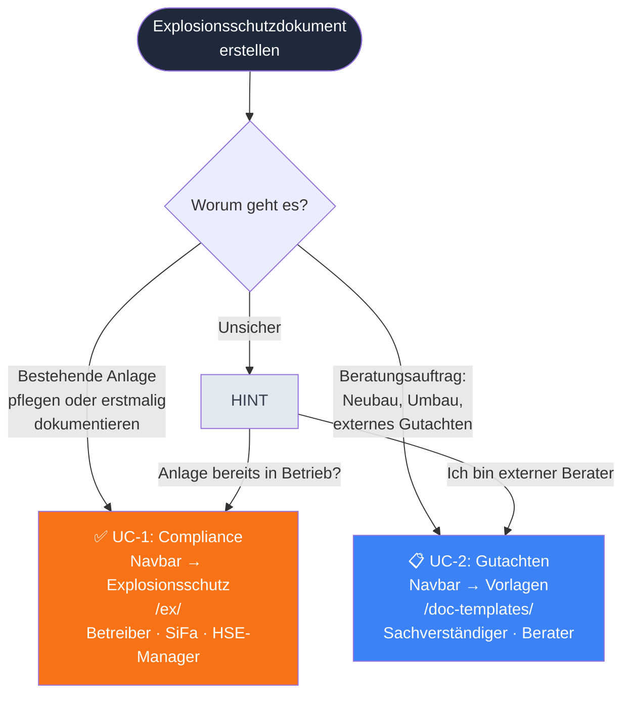
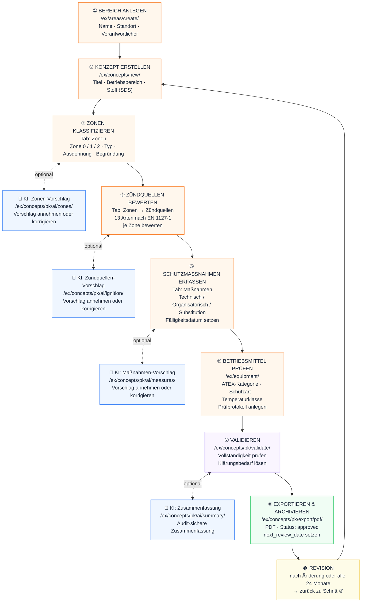
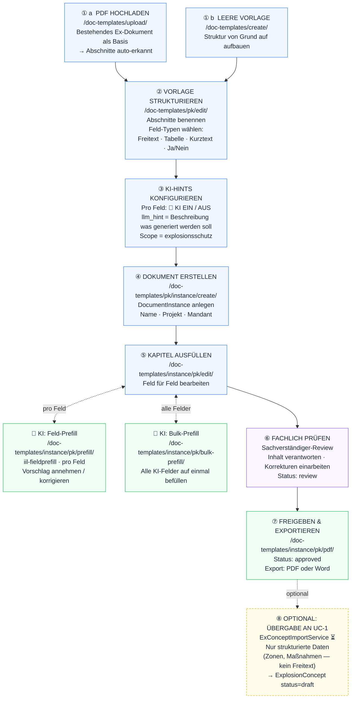
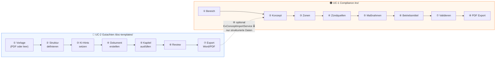

# Ex-Dokument — Prozessworkflow UC-1 & UC-2

> **Stand:** 2026-04-22  
> **Zweck:** Schrittweise Prozessführung für beide Wege zur Erstellung eines
> Explosionsschutzdokuments nach § 6 Abs. 9 GefStoffV in risk-hub (Schutztat).

---

## Welcher Weg ist der richtige?

---

## UC-1: Compliance-Workflow

> Navbar → **Explosionsschutz** · Persona: Betreiber, SiFa, HSE-Manager  
> Output: §6(9)-Pflichtdokument als PDF · Wiederholung alle 24 Monate (TRGS 720 Nr. 5)

### Schritte auf einen Blick — UC-1

| # | Schritt | URL | Ergebnis |
|---|---------|-----|----------|
| ① | Bereich anlegen | `/ex/areas/create/` | `Area` mit Standort |
| ② | Konzept erstellen | `/ex/concepts/new/` | `ExplosionConcept` status=draft |
| ③ | Zonen klassifizieren | Konzept-Detail → Tab Zonen | `ZoneDefinition` (Zone 0/1/2) |
| ④ | Zündquellen bewerten | Konzept-Detail → Tab Zonen | `ZoneIgnitionSourceAssessment` (13 Arten) |
| ⑤ | Schutzmaßnahmen | Konzept-Detail → Tab Maßnahmen | `ProtectionMeasure` (TOPS) |
| ⑥ | Betriebsmittel | `/ex/equipment/` | `Equipment` + `Inspection` |
| ⑦ | Validieren | `/ex/concepts/pk/validate/` | Status: in_review |
| ⑧ | Export + Archiv | `/ex/concepts/pk/export/pdf/` | PDF, Status: approved |
| 🔄 | Revision | alle 24 Monate / bei Änderung | neues Konzept aus Schritt ② |

---

## UC-2: Gutachten-Workflow

> Navbar → **Vorlagen** · Persona: Sachverständiger, externer Berater  
> Output: Ausformuliertes Gutachten (Word/PDF) · Einmalig je Projekt

### Schritte auf einen Blick — UC-2

| # | Schritt | URL | Ergebnis |
|---|---------|-----|----------|
| ① a | PDF hochladen | `/doc-templates/upload/` | `DocumentTemplate` aus PDF-Extraktion |
| ① b | Leere Vorlage | `/doc-templates/create/` | `DocumentTemplate` leer |
| ② | Vorlage strukturieren | `/doc-templates/pk/edit/` | Abschnitte + Felder konfiguriert |
| ③ | KI-Hints setzen | (in Schritt ②) | `llm_hint` pro Feld, `scope=explosionsschutz` |
| ④ | Dokument erstellen | `/doc-templates/pk/instance/create/` | `DocumentInstance` status=draft |
| ⑤ | Kapitel ausfüllen | `/doc-templates/instance/pk/edit/` | `values_json` befüllt |
| ⑥ | Review | (manuell) | Status: review, Berater-Verantwortung |
| ⑦ | Export | `/doc-templates/instance/pk/pdf/` | PDF/Word, Status: approved |
| ⑧ | → UC-1 übergeben | `ExConceptImportService` ⏳ | `ExplosionConcept` status=draft |

---

## Beide Workflows im Vergleich

| Kriterium | UC-1 Compliance | UC-2 Gutachten |
|-----------|:-:|:-:|
| **Einstieg** | Bereich anlegen | PDF hochladen / leer |
| **Struktur** | fest (Zone, Maßnahme, Equipment) | frei (JSON-Felder je Vorlage) |
| **KI-Ebene** | Kapitel-Level (Zonen, Maßnahmen, Summary) | Feld-Level (jedes Textfeld) |
| **Output** | WeasyPrint-PDF | Word oder PDF |
| **Verantwortung** | Betreiber (laufende Pflicht) | Sachverständiger (Projektauftrag) |
| **Audit** | `GenerationLog` + `AuditEvent` | `values_json` |
| **Wiederholung** | alle 24 Monate | einmalig je Projekt |

---

*Erstellt: 2026-04-22 · `iil-doc-templates` v0.3.0 · `iil-aifw` (Groq Llama 3.3 70B) · `iil-fieldprefill`*
